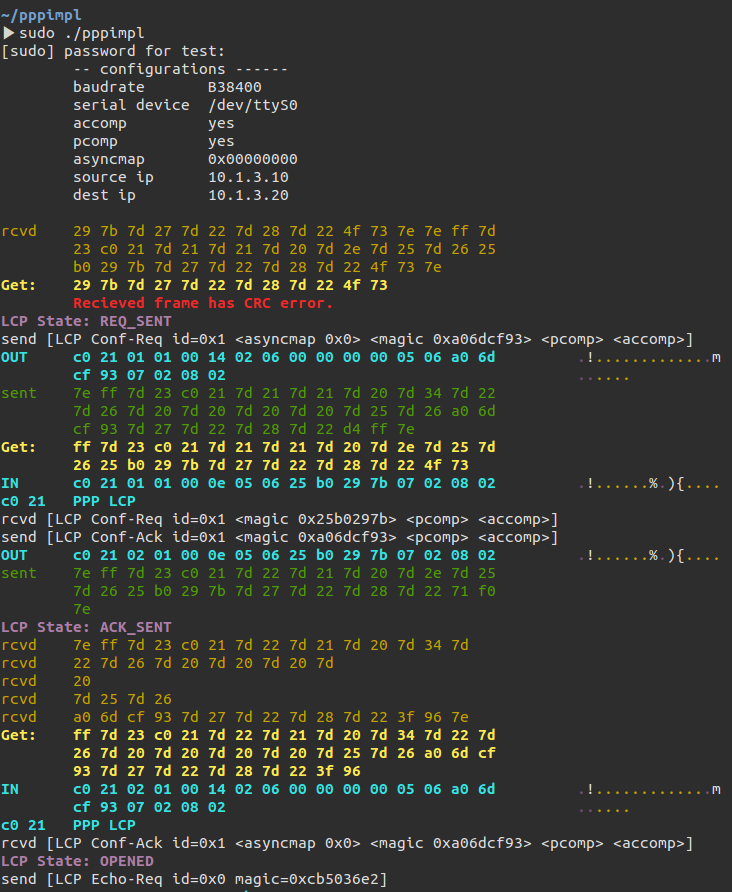

# 구현된 기능

기본적인 LCP, IPCP connect를 구현했다. network layer에서 ICMP 패킷을 주고받는 기능은 없다. CCP는 지원하지 않는다.

AHDLC character escaping과 CRC-16을 지원. 옵션으로 asyncmap을 바꿀 수 있다. 

accomp, pcomp 옵션 여부도 끄고 켤 수 있다. 통신할 때 상대방과 옵션이 다를 경우 원래 pppd와 유사하게 Conf-Rej를 보낸다. 반대로 상대방으로부터 Conf-Rej를 받을 경우 자신의 옵션을 바꾼다.

## 빌드 방법

`make`로 프로젝트 구성이 되어 있다. `make`의 기본값은 `debug`로 통신 과정에서 받거나 보낸 패킷의 hex 값을 모두 출력한다. `make release`로 프로젝트를 빌드할 경우 원래 pppd와 유사하게 주고받은 패킷을 요약해 보여준다.

빌드는 `gcc`를 그대로 사용하지만 `-std=gnu99` 옵션을 줬다. 따라서 c99 문법으로 작성되어 있고 gnu extension으로 유닉스 함수를 사용한다. `-lrt` 옵션으로 개선된 clock 함수를 사용해 타이머를 구현했다.

## 실행 방법 및 옵션

`make`의 결과물로 `pppimpl`이라는 프로그램이 프로젝트 폴더에 생성된다. `./pppimpl <옵션>`으로 실행시킬 수 있다. 옵션은 기본값이 정해져있고, 다음과 같은 옵션을 받을 수 있다.

| 옵션       | 예시                    | 설명                                       |
| -------- | --------------------- | ---------------------------------------- |
| baudrate | `B38400`              | 통신에 사용하는 baud rate. `B`로 시작하며 지원되는 주파수가 정해져있다. 인식되지 않을 경우 기본값은 38400이다. |
| dev path | `/dev/ttyS0`          | 통신에 사용할 시리얼 파일. `/`로 시작해야 인식한다.          |
| accomp   | `noaccomp`            | ACFC 옵션. 기본으로 켜져있다.                      |
| pcomp    | `nopcomp`             | PFC 옵션. 기본으로 켜져있다.                       |
| ACCM     | `asyncmap 0xFFFFFFFF` | AHDLC escape character map을 정할 수 있다. 기본값은 `0`이다. |
| IP       | `10.1.3.10:10.1.3.20` | 스스로의 IP와 통신 대상의 IP 주소.                   |

예시: `./pppimpl B38400 asyncmap 0xFFFFFFFF 10.1.3.10:10.1.3.20` 

## 실행 화면 분석

`rcvd xx xx ...`, `sent xx xx ...`
실제로 주고받은 바이트 스트림 값.

`Get: xx xx ...`
받은 바이트 스트림을 프레임 단위로 나눈 것

`IN xx xx ...`, `OUT xx xx ...`
AHDLC를 이스케이핑하고 CRC값을 평가한 후 구한 프레임 데이터. CRC 값이 비정상일 경우 오류 메세지를 출력하고 데이터를 무시한다.

`rcvd [...]`, `send [...]`
주고받은 프레임의 내용을 요약한 것

`LCP State: ...`, `IPCP State: ...`
LCP와 ICPC의 State Machine 상태를 나타낸다.

# 코드 분석

`main.c`
프로그램의 메인 함수. 인자를 파싱하고 프로그램을 초기화한 후 PPP 통신 과정을 수행한다.

`common.h`
프로젝트에서 사용할 일반적인 타입에 대해 정의가 적혀있다. c99의 `true`, `false`와 `byte`, `u16`, `u32`가 정의되어 있고, byte 배열과 사용된 길이를 가지고 있는 `byte_buf` 구조체가 정의되어 있다.

`utils.h` / `utils.c`
프로젝트에서 사용할 타이머와 랜덤 함수, 바이트 연산 함수, 디버그 출력 함수 등이 정의되어 있다.

`physical.h` / `physical.c`
파일 핸들을 가지고 통신을 해서 raw data를 주고받는 모듈이다.

| 함수명            | 설명                                       |
| -------------- | ---------------------------------------- |
| `phy_init`     | `device_name`과 `baud`를 받아 시리얼 파일을 연다.    |
| `phy_close`    | 시리얼 파일을 닫는다.                             |
| `phy_read`     | 시리얼 파일로부터 데이터를 읽는다.                      |
| `phy_getFrame` | 받은 데이터를 `7e`로 구분된 프레임 단위로 끊어 버퍼에 복사한다. 프레임 단위의 데이터가 완전히 도착하지 않은 경우 받지 못하므로 버퍼의 길이는 0이다. |
| `phy_send`     | 프레임 단위의 데이터를 상대방에게 보낸다.                  |

`ahdlc.h` / `ahdlc.c`
FCS-16와 asynchronize와 관련된 함수로 HDLC 프레임을 만들거나 해석하는 모듈이다.

| 함수명              | 설명                                       |
| ---------------- | ---------------------------------------- |
| `makefcs`        | 프레임 데이터 뒤에 FCS-16을 붙인다.                  |
| `checkfcs`       | 프레임 뒤에 붙어있는 FCS-16 값이 유효한지 검사한다.         |
| `async`          | ACCM을 받아 프레임 데이터를 asynchronize한다.        |
| `unasync`        | 프레임 데이터를 escape 한다.                      |
| `hdlc_getInfo`   | HDLC Frame을 받아 Protocol Field와 Information이 escape된 형태로 만든다. |
| `hdlc_makeFrame` | 반대로 데이터를 HDLC Frame 형태로 만든다.             |

`ppp.h` / `ppp.c`
PPP 전체 통신 과정을 담당하는 모듈이다.

| 변수명 / 함수명       | 설명                                       |
| --------------- | ---------------------------------------- |
| `ppp_terminate` | PPP가 terminate되었는지의 여부를 나타내는 flag 값. 상대방에게 LCP termination request를 받거나 Ctrl+C로 프로그램 종료 신호를 받았을 때, 또는 Configuration 과정이 이루어지지 않고 시간초과가 났을 때 이 값이 `true`가 되고 PPP State가 바로 Termination으로 바뀌게 된다. |
| `rcvd_frame`    | 받은 프레임 데이터를 들고있는 버퍼 변수.                  |
| `ppp_run`       | PPP 통신을 실행하는 함수. 통신이 끝나면 끝나게 된다.         |

`lcp.h` / `lcp.c`
LCP State Machine을 구현하는 모듈이다.

| 요소           | 설명                                       |
| ------------ | ---------------------------------------- |
| `lcp_srccf`  | LCP Configuration에 필요한 데이터. main 함수에서 설정해주게 된다. |
| `lcp_dstcf`  | 상대방의 LCP Configuration 데이터. Configuration 과정이 완료되면 이 값이 설정되고 통신에 사용된다. |
| `lcp_opened` | LCP State가 `OPENED`인지의 여부. PPP 통신 진행을 위해 사용된다. |
| `lcp_closed` | LCP State가 `Closed`인지의 여부. LCP Termination 과정이 끝났는지 알기 위해 사용된다. |
| `lcp_do`     | LCP State Machine을 작동시키는 함수. PPP 모듈에서 while문 안에서 매 틱마다 수행시켜 State Machine을 작동시킨다. |

LCP State Machine은 data link layer만 고려하여, 전체 State Machine의 상위 반만 구현되어 있다. 주고받은 데이터에 따라 State가 계속 변하게 된다. LCP Frame을 받았는지 확인하고 만약 처리할 수 없는 프레임이더라도 LCP Frame이면 경고를 출력하고 데이터를 discard한다.

`ipcp.h` / `ipcp.c`
IPCP State Machine을 구현하는 모듈이다. LCP 모듈과 거의 유사하게 작성되어 있다.